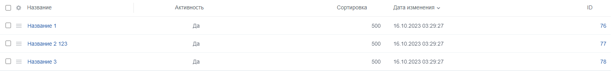
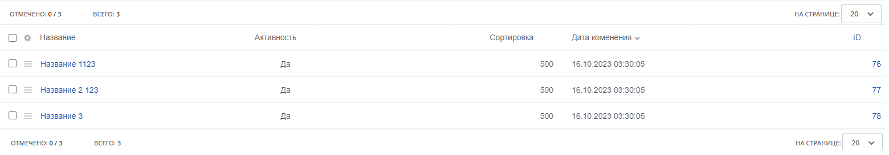

<h1>Advantika. Тестовое задание</h1>

<h2>Необходимо выполнить задание на платформе 1С-Битрикс Управление сайтом "Старт", используя стандартное api платформы.</h2>

Рекомендую ознакомиться с документацией: https://dev.1c-bitrix.ru/api_help/ - для разработчика.

<h3>Задание:</h3>

Необходимо написать скрипт парсинга файла test.csv с сохранением информации в инфоблок используя методы модуля инфоблоки;
При повторном запуске скрипта должна производиться проверка на внесение изменений в файл, и при наличии изменений созданные элементы должны актуализироваться;
Загрузить данный скрипт в систему контроля версий git и предоставить ссылку на репозиторий.
В ходе выполнения задания частые коммиты с небольшим описанием приветствуются.

<h3>Иллюстрации выполненного задания</h3>

<figure>
  
 <figcaption>Вывод информации из csv файла</figcaption>
</figure>
 
<figure>
  
 <figcaption>Вывод информации из csv файла</figcaption>
</figure>
 
<figure>
  
 <figcaption>Обновление блоков</figcaption>
</figure>
 
<figure>
  
 <figcaption>Обновление блоков</figcaption>
</figure>

